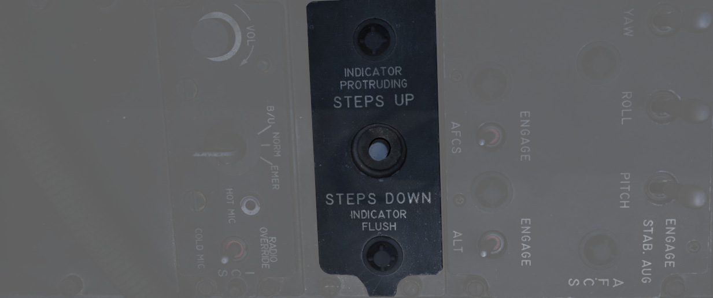
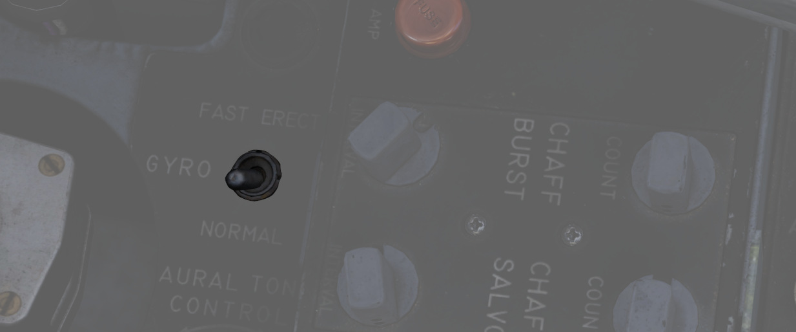

# Aft Section

The aft section of the left console has the [intercom](../../../systems/nav_com/intercom.md)
and [countermeasure](../../../systems/defensive_systems/countermeasures.md) controls.

## Boarding Steps Indicator

Used to visually confirm the integrated boarding steps state. With
the white post up, steps are stowed, whereas steps are deployed if post
is down and flush with panel recess. The boarding steps and ladder is moved
by the [crew chief](../../../crew_chief/overview.md).

## Intercom System Control Panel

### Volume Control Knob

The volume control knob (<num>1</num>) is turned clockwise to increase audio between cockpits, and
counterclockwise to decrease audio between cockpits on
the [Intercom](../../../systems/nav_com/intercom.md).

### Amplifier Select Knob

The amplifier select knob (<num>2</num>) determines current amplifier
for [intercom](../../../systems/nav_com/intercom.md) function.

| Name | Description                                                                                                     |
|------|-----------------------------------------------------------------------------------------------------------------|
| B/U  | Backup headset amplifier provides audio.                                                                        |
| NORM | Primary headset amplifier provides audio.                                                                       |
| EMER | Uses the amplifier from opposite cockpit; all and only audio including radio received to that cockpit is heard. |

### Function Selector Switch

The function selector switch (<num>3</num>) has three positions:

| Name           | Description                                                                                                       |
|----------------|-------------------------------------------------------------------------------------------------------------------|
| COLD MIC       | Mic switch on throttle must be held to activate intercom.                                                         |
| HOT MIC        | Voice automatically transmitted on intercom.                                                                      |
| RADIO OVERRIDE | Voice automatically transmitted on intercom. All volumes but Shrike tone and Stall Warning are reduced in volume. |

## AN/ALE-40 Programmer

The panel features 6 knobs to
control [chaff and flare programs](../../../systems/defensive_systems/countermeasures.md#anale-40-countermeasures-system),
as well as two lamps and a switch to activate flares on its base.

Chaffs can be programmed to be released in Salvos and Bursts.
A Salvo consists of multiple bursts, while a burst will release multiple chaffs.

### Chaff Burst

The **count knob** (<num>4</num>) selects the quantity of chaffs released per burst;
values of 1, 2, 3, 4, 6, or 8 from left to right.

The **interval knob** (<num>1</num>) selects the time interval of .1, .2, .3, or .4 seconds
between each chaff released in that burst.

### Chaff Salvo

The **count knob** (<num>5</num>) selects how many bursts the salvo consists of,
values of 1, 2, 4, 8, or C (Continuous).

In the Continuous setting,
the program is repeated as long as the dispense button is held down.

The **interval knob** (<num>2</num>) selects the time interval between each burst.
Values of 1, 2, 3, 4, 5, 8, or a R (Random) number of seconds.

### Flare Burst

The **count knob** (<num>6</num>) selects the quantity of flares released per burst.
Values of 1, 2, 4, 8, or C (Continuous).

Continuous will repeat the program as long as the dispense button is held down.

The **interval knob** (<num>3</num>) selects time interval between each flare released.
Values of 3, 4, 6, 8, 10 number of seconds.

### Flares Select Switch

The flares select switch (<num>9</num>) controls which countermeasure will be released when the
pilot
presses
the Dispense Button.

In the NORMAL setting, countermeasure are released according to what the WSO setup
on their panel.

FLARES allows the pilot to activate the flares regardless of WSO selection.
This can for example be used to react quickly to a threat.

### Flares Indicator Light

The flares indicator light (<num>8</num>) illuminates when the [_Flares
Select_](../../../systems/defensive_systems/countermeasures.md#flares-select-switch) switch is in
the Flares position and indicates they can be dispensed,
if [flaps and speed brakes](../../../systems/flight_controls_gear/flight_controls.md) are retracted.

### Power On Indicator Light

The power on indicator light (<num>7</num>) illuminates when the [_Flares
Select_](../../../systems/defensive_systems/countermeasures.md#flares-select-switch) switch is in
the Normal position and either the Chaff or Flare (or both) mode knobs in
the [WSO cockpit](../../wso/overview.md) are in any position other than OFF.

## Gyro Fast Erect Switch

Selects gyro operation. FAST ERECT can be used momentarily to correct gyro deviations.

See [3.11.4. ARBCS](../../../systems/weapon_systems/arbcs.md#gyro-fast-erect) for details.

## Aural Tone Control

Knob to control the volume for weapon tones, such as the Sidewinder seeker head.

## Anti-G Suit Control Valve

The anti-G system delivers low-pressure auxiliary air to the anti-G suits, with air passing through
the anti-G suit control valve before reaching the suit. The suit remains deflated up to
approximately 1.5 G, and as G forces reach or exceed this level, air flows into the suit
proportionally. The suit stays inflated in relation to constant G forces and begins to deflate as G
forces decrease.

A manual inflation button in the anti-G suit control valve enables the crewman to manually inflate
the suit for system checks or fatigue relief. A pressure relief valve within the system activates at
approximately 11 psi, serving as a safety backup in case of malfunction. The system operates
automatically whenever an engine is running, ensuring continuous support for the wearer during
varying G-force conditions.
