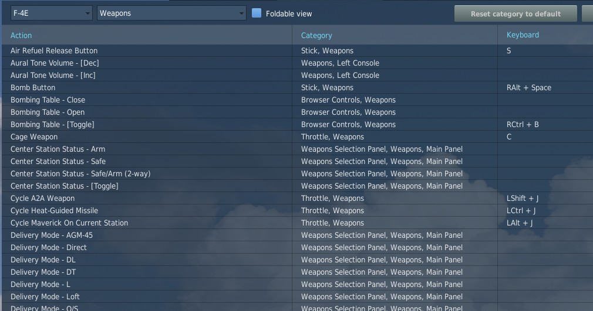
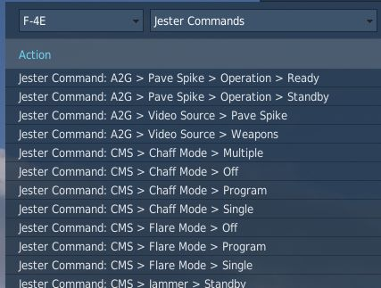

# Controls

Available control binds for the Phantom are exhaustive. For any switch, knob or
button, you can choose between direct position-binds, increment or decrement
binds, a toggle or next option, special binds for 2-way or 3-way switches and
assignable axis.

In total, both cockpits feature around 1000 assignable binds and 200 axis each.

As example, the **Speed Brake** switch provides 8 binds:

- Speed Brake - In
- Speed Brake - Stop
- Speed Brake - Out (Hold)
- Speed Brake - [Aft]
- Speed Brake - [Forward]
- Speed Brake - [Next]
- Speed Brake - In/Stop (3-way up)

The **Out**-position is marked **(Hold)** to signal that the position is
spring-loaded and will return to center once released.

Binds **[Aft]** and **[Forward]** are directional binds that move the switch
from the current position into the given direction.

**[Next]** is similar, but will not stop at the last position and wrap over to
the first position again. Likewise, 2-way switches provide a **[Toggle]** bind
that flips the switch between either position.

The **(3-way up)**-bind is intended to be used with actual 3-way hardware
switches, such as present on many external devices. They send a signal on either
position (up and down), but no signal on the center position. Hence, the bind
will return the switch back to the center when no signal is send.

> 💡 The **(3-way down)**-bind is skipped for the Speed Brake, since it would be
> identical with the spring-loaded **Out (Hold)**-bind.

All binds are generally assigned at least two searchable categories, the
**system** the bind belongs to and its **location** in the cockpit. The **Master
Arm** switch for example has categories:

- Weapons
- Main Panel
- Weapon Selection Panel

## Sim-Pit

Additionally to regular binds, special **[SimPit]**-binds are provided that
allow controlling any switch or knob via an axis input.

For example, a switch with 2 positions ON and OFF can be controlled with an
axis, while the switch changes its position as soon as the axis is pushed beyond
its center position.

This is especially useful for builders of cockpit replicas, working mainly with
hardware switches whose electronic components send normalized inputs through the
entire movement range.

## Jester & Chief Commands

Direct binds to control Jester and Crew Chief commands are provided especially
for mission designers or users of voice recognition software, such as
**VoiceAttack**.

This allows use of the corresponding actions directly via a bind instead of
using the UI to select them.

## Binding Guide

When just getting started, a common question is which controls one should
generally bind and have accessible without using the mouse, besides the obvious
binds of throttle and stick axis.

> 💡 Items marked **bold** are highly recommended to be bound.

### Pilot

THe pilot should focus at binding the major flight controls, as well as combat
relevant switches.

#### Flight Controls

- **Stick**
- **Throttle**
- **Trim Controls**
- Landing Gear
- Flaps/Slats
- Airbrake
- Eject
- **Nose Gear Steering / Auto Acquisition Button**
- **Drag Chute**
- Seat Controls

#### Startup

To execute the cold-start sequence, binds of interest are:

- Crew Chief Command: Air Source > Load Starter Cartridges
- Start Engine Switch Left/Right (fires up Starter Cartridges)
- Generator Left/Right
- Left/Right Engine Master Switch
- **Left/Right Engine Ignition**
- Left/Right Engine Idle Detent

#### Combat

- **Trigger**
- **Bomb Button**
- **Weapon Slew**
- **Pinky Switch**
- **CAGE Button**
- **Nose Gear Steering / Auto Acquisition Button**
- DSCG Mode
- Bombing Tool
- **Dispense Countermeasures**
- HUD Mode
- Delivery Mode
- Weapon Selector

#### Navigation

- **Microphone Switch**
- Navigation Input
- Navigation Mode
- COM Channel
- AFCS Switch
- ALT Hold Switch
- AAR Release Switch

#### Jester

- **Jester UI Action**
- **Jester Context Action**

### WSO

For the WSO it is optional to bind flight controls such as the flight stick.
Controls should be focused at operating the Radar and the Pave Spike targeting
pod.

#### Radar & Pave Spike

- **Antenna Hand Control**
- **Antenna Hand Control Trigger**
- **Antenna Elevation**
- **Antenna Hand Control Challenge Button**
- Screen Mode

#### Radar Controls

- **Radar Receiver Gain**
- Radar Range
- Target Aspect
- Radar Mode

#### Combat Relevant

- **Dispense Countermeasures**
- Video Select
- Air to Air (CAGE) Mode
- **Freeze Button**
- Insert Target Button
- Move Cursor (Along/Cross Track)

#### Navigation Controls

- **Microphone Switch**
- COM Channel
- **Navigation Function**
