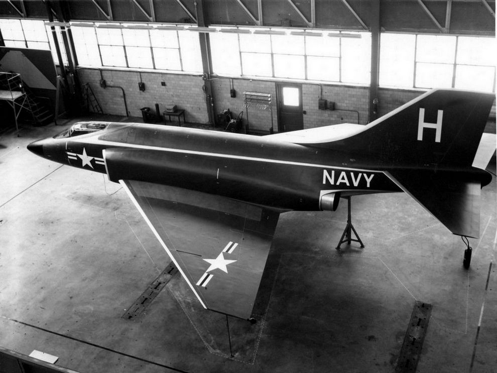
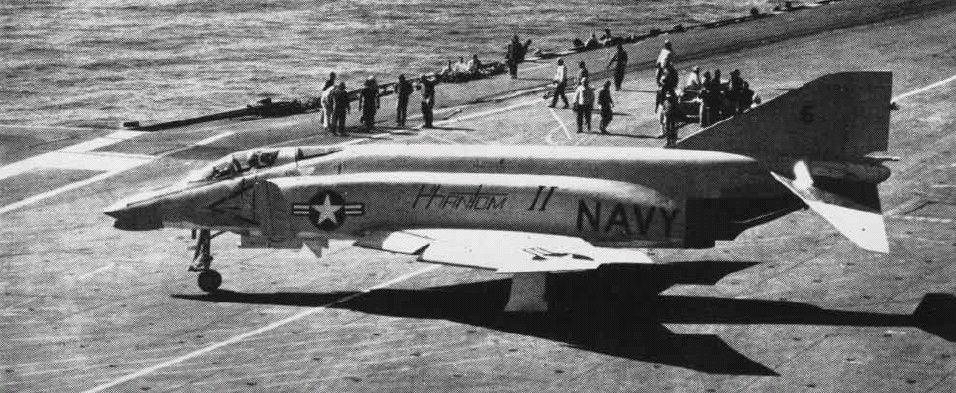
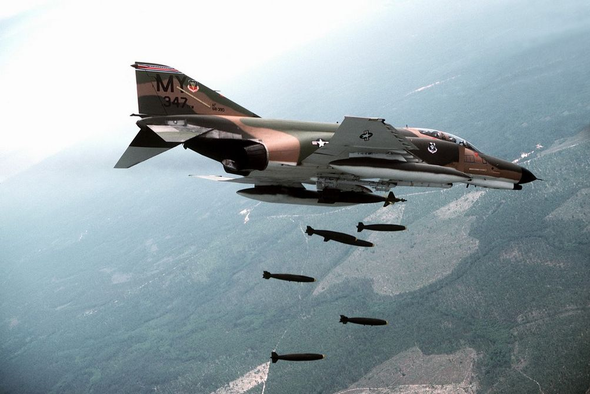
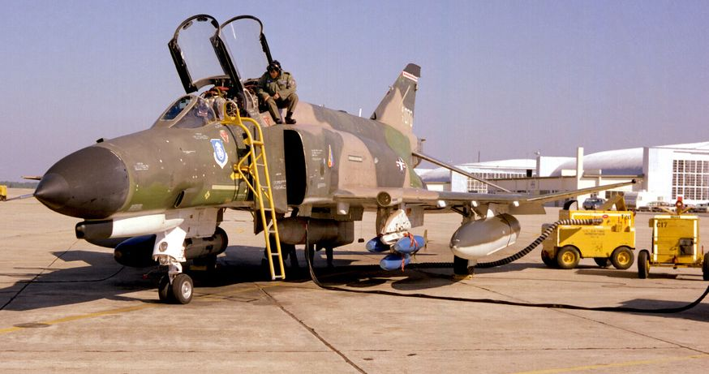

# Historical Background

## 1953-1958: Development Phase (F3H to AH-1 and F4H)

_(Mockup of the F-4 with AIM-7 Missiles)_

The developmental onset of the **F-4 Phantom II** began in the aftermath of
McDonnell's loss in the US Navy's 1953 **Day Fighter Competition** - the victor
of which was the **Vought F8U**. Choosing not to rest on failure, McDonnell
representatives canvased the Navy Bureau of Aeronautics, a number of operational
commands, the office of the Chief of Naval Operations, and any pilot or
maintainer willing to discuss the state of current naval aviation.

After nearly a year of analysis and design work - including a full scale mockup,
the design of what they would classify as a **general fighter** took shape. The
potential of a general fighter aircraft, rather than the specialized focus
preferred by the Navy at the time, was rooted in the success of the **F3H-1
Demon** in threading of that very needle.

### F3H-1 Demon

The Demon had been built as design in opposition of the **F4D Skyray** in the
interceptor role. As the Skyray proved its supersonic superiority during the
development cycle, McDonnell expanded the F3H Demon's capabilities to include
respectable air to ground armament to justify its place in the limited carrier
compliment when compared to the **F10F Jaguar** and **F7U Cutlass**, which were
also undergoing development at the time.

Ultimately outfitted with the AIM-9 Sidewinder and AIM-7 Sparrow - the latter
giving the F3H a beyond visual range capability the Skyray could never boast,
and topping out with the ability to carry and deliver 6,000 lbs of air to ground
ordnance, the Demon out-measured its competitors in combat potential, even when
it came in second on paper for raw performance.

Beginning with the intention to grow out the Demon as the baseline airframe, a
set of engineering evaluations were performed including both single and twin
engine configurations with different wings. The two most promising data sets-
twin-engine builds of the type designated the **F3H-G** and **F3H-H** powered
the General Electric J65 and J79 respectively, replaced the original Demon wing
with a 45 degree swept wing.

Particular focus was paid towards making the new aircraft **multi-mission
capable**, running a wide gamut of potential operations: day or all-weather
attack, photo recon, day or all-weather interception with a Sparrow-compatible
radar, electronic warfare, and a two seat strike coordination configuration.
Experimentation with this wide-ranging design intent went so far as to include a
novel interchangeable nose and cockpit arrangement, allowing airframes to be
reconfigured within a matter of hours for a given mission set with the necessary
systems fit for the crew.

While the Navy showed little interest in the nose replacement capability, the
bottom line numbers from the F3H-G and -H investigations got their attention. On
paper, they were capable of reaching Mach 1.52, and an eye-watering Mach 1.97 at
35,000 feet, respectively.

By October of 1954, Navy Bureau of Aeronautics (BuAer) had evaluated similar
unsolicited proposals from Grumman, Douglas, and North American, and provided
McDonnell with a $38 million dollar contract for two flying examples of the
Demon follow on - internally designated as the **AH-1**.

 _(McDonnell F3H-G mockup; US Navy
photo)_

### AH-1

Two months later, the Navy threw McDonnell a curveball, directing the type to be
**stripped of the air to ground fitment**, and focusing on the all-weather
interceptor role in a single seat configuration, with the finalization for this
change in role being formally announced in April of 1955.

The changeover was, in some quarters, considered catastrophic - over time
forcing the removal of the planned internal gun, and stripping all of the
hard-points, save for the recessed Sparrow fuselage wells and a centerline tank
position. At this point, the determination of the **J79** as the power plant was
finalized with the Navy's desire for a Mach 2 interceptor. Further, the
determination of a two-man crew as also put in place by the Navy - like
McDonnell's own research, success in the faster, longer ranged interception
environment showed the utility of a second man to handle the scope.

However, it wasn't a done deal. BuAero had been keeping conversation with Vought
at the same time, and in mid-1955 detailed a fly-off between the two competing
firms for the new interceptor role; this time pitting McDonnell's AH-1 contender
with an outgrowth of the already in-service **Crusader**: the **F8U-3**.

### F4H (F-4A)

Redesignated the **F4H** (or also **F-4A**) in the intervening two and a half
years leading into the late 1958 fly-off, McDonnell's Phantom II would trade
substantial blows with Vought's Crusader III during the Navy Preliminary
Evaluation. Whereas McDonnell's design entered the flight testing phase a month
prior (and nominally entered engineering almost a year ahead of Vought's entry),
the benefits of Vought carrying over much of the prior Crusader's aerodynamic
profile appeared early in the comparison. The Crusader III was first to reach
Mach 2 in flight testing, shown capable of reaching higher top speeds during the
Navy preliminary evaluation, and noted for having more refined airframe handling
in most regimes.

_(F-4H aboard the USS Independence in 1960; US Navy photo)_

But as the Evaluation continued, it was found that McDonnell's Phantom II
countered the Crusader III where it mattered: in **combat capability**. The Navy
wanted a Mach 2 interceptor, not an overgrown daylight fighter.

The F8U-3's integration of the Sparrow was found lacking versus that of the
Phantom, having surrendered an AIM-7 against the F4H due to aerodynamic
performance concerns. Of even greater concern for the interceptor role - as
McDonnell had previously found internally, the pilot overhead to manage the
AN/APG-74 radar installation in the Crusader III while in combat was found to be
too high to maintain effectiveness, whereas the back-seater in the Phantom II
could reliably acquire situational awareness on the radar and maintain track
locks for engagement while maneuvering.

McDonnell's F4H, while having more raw flying qualities, could fight as the Navy
needed it to. Further, as the firm had continued developing its air to ground
potential at the request of the Navy, even as they repeatedly altered the
program goals - the Phantom II, like the Demon before it, justified its
existence in the carrier compliment in all fights, not just the long range
interception role. And so on December 17th, 1958, the Navy Preliminary
Evaluation board announced its findings and the **winner of the fly-off:
McDonnell's Phantom II**.

## 1958-1963: A Navy Interceptor with Multi-role Pedigree (F4H to F-110 and F-4)

The US Air Force was not oblivious to the Phantom II's development, as the Navy
having asked for the air to ground capability be revisited gave McDonnell a
point of entry. While the Air Force entertained McDonnell representatives in
discussion about a new ground attack airframe, the service actually had interest
in the Sparrow-dealing F4H as a replacement for the **F-106**.

The Air Defense Command requested an evaluation in 1961 known as _Project High
Speed_, which once again proved the Phantom II superior to a challenger in the
interceptor role. In light of the findings, Navy offered a bombing demonstration
for Air Force representatives of the Tactical Air Command, making special note
of the successful air to ground trials with the Phantom's multiple ejector
racks - a capability the USAF lacked. With Air Force policymakers, members of
Congress, and even General Curtis LeMay in attendance during this demonstration
series - with a VX-5 F4H-1 accurately delivering twenty-two 500 lb bombs in
spectacular fashion, the stage was set for a Navy/McDonnell tactical aviation
coup.

 _F-4E Phantom II
of the 347th Tactical Fighter Wing airdropping six 500-lb Mark 82s_

The inauguration of the Kennedy administration in January 1961 didn't hurt
matters; Kennedy brought in former Ford Motor Company president Robert McNamara
as Secretary of Defense. With an eye for optimization - sometimes to a fault,
the performance of McDonnell's F4H was seen as a standout to capitalize upon in
light of the administration's new conventional doctrine of _"Flexible
Response"_; no longer would nuclear deterrence be the primary backstop of the
US' promise to NATO.

While McNamara desired for the Navy's **A-7** and the Air Force's **F-111** to
fulfill tactical bombing roles for both services, the two airframes were at
least five years out to operational capability; the Phantom existed, provided
outstanding performance immediately, and could quickly raise the desired 50%
increase in conventional force structure the White House expected for the Air
Force. Pressure from all sides - the White House, Congress, McDonnell, and
foreign interest, ultimately defeated the USAF's resistance to an airframe _"not
made here"_, and by January 1962 the USAF's budget had **Phantoms on order the
Tactical Air Command**; the Air Defense Command, which had started the Air
Force's investigation into the Phantom, would be left with the **F-106**.

### F-110 Spectre

Designated for a time as the **F-110** to fit in with the Air Force's Century
Series as a matter of service pride, McDonnell's Air Force Phantom went into
motion. An initial delivery of Navy-configured F4Hs were provided for training
and evaluation later that year, with the first flight of a true **F-4C** taking
place on May 27th, 1963 - the universal service designation system converting
the F4H-1 to the **F-4B** in September of 1962.

### F-4B and -C

Reconfiguration of the Phantom II for the USAF was expedient, with the focus
being on service-compliant alterations. These included altering of the landing
gear system for higher speed field operations, the addition of dual flight
controls, an anti-skid implementation, and conversion to boom refueling
compatibility.

Further changes included the addition of the LN-12 inertial navigation system,
conversion to the APQ-100 radar with air to ground specific functionality, and a
cartridge starting system for field use without a compressed air cart in
combination with an internal battery.

This F-4C configuration would be the first Phantom used during the USAF's
involvement in **Vietnam**, beginning in December of 1964.

## 1965-1974: Backtracking with Haste - Vietnam (F-4D and F-4E)

_(F-4B dropping bombs over Vietnam; US Navy Photo)_

The Phantom's initial deployments to Southeast Asia delivered a number of
firsts - the first officially **confirmed MiG-17 kill** with the AIM-9
Sidewinder (on July 10th, 1965), and the first US air-to-air **shootdown of a
MiG-21** (April 26th, 1966). Unfortunately, the Phantom was also the victim of
the **first US loss to a SAM** in Vietnam (July 24th, 1965), and the first US
air-to-air **loss from a MiG-21** (October 5th, 1966).

With the initial teething problems of the type out of the way - including
alterations to the wing fuel cells and internal wiring, the Phantom was found to
be a capable, reliable airframe for the Air Force. Even the missing gun had been
worked around to some degree, with the integration of the SUU-16 and SUU-23
**external cannon pods**.

### F-4D

The in-production upgrade to the Air Force's first Phantom - the **F-4D**, would
include a multitude of quality of life improvements: the APQ-109 radar with air
to ground modes, the ASN-63 internal navigation system, the ASQ-92 release
computer. Further additions would include automatic fuel transfer and a new
sight, the ASG-22. Combat survivability would be reinforced with the APS-107
RHAW and ECM pod compatibility, along with new ejection seats. Yet, the
service's desire to put its own _"made here"_ flourish on the type continued,
inauspiciously culminating in the integration of the **AIM-4 Falcon** with the
F-4D model.

#### AIM-9 vs AIM-4

Used on the **F-102 Delta Dagger** and **F-106 Delta Dart**, and considered by
some to be a reasonable competitor to the **AIM-9 Sidewinder**, Air Force
leadership believed the AIM-4 Falcon could be installed in replacement of the
Navy's short range round with no loss of capability; this was quickly found to
be a mistaken premise.

While the AIM-9B had limited maneuvering restrictions for launch and acquisition
like other short range infrared missiles of its generation, it was substantially
more reliable in use; the Falcon's cooling implementation could only maintain
the required seeker temperature for a short time once activated, and could not
be turned back on once the cooler timed out, while the un-cooled 9B could remain
available indefinitely.

Sidewinder acquired far more rapidly - in many instances in less than two
seconds, versus the six to seven seconds required for the Falcon.

Worse still, the AIM-4 was a hittile - its fin-contact triggered fuzing required
direct target impact for the missile's warhead to detonate, whereas the AIM-9
carried a proximity fuze; any Sidewinder that got close to its target was a
threat to kill.

 _(F-4D of the 435th
TFS over Vietnam)_

With initial F-4D deliveries to the 8th TFW in May of 1967, the performance of
the new configuration was quickly met with derision. The employment envelope was
too small compared to the Sidewinder, the lead time too long, and the weapon far
too unreliable to put into practice in the dynamic maneuvering environment of
air combat as it was waged in Southeast Asia.

The failure of the Falcon to succeed not only served to reaffirm the quality of
the Sidewinder in comparison - and also highlight the need for the service to
upgrade the round as the Navy was doing, but reinforced the concern held by
aircrews about the lack of an internal gun. SUU installations by this point had
scored multiple victories over North Vietnamese MiGs (ultimately ending the war
with **9 confirmed kills**), and it was decided to rectify what many had
considered the Phantom's original sin with further revision to the F-4.

### F-4E

By the point McDonnell laid down the program update plan for the F-4E, the jet
was intended to carry with it the APQ-120 CORDS (Coherent On Receive Doppler
System) radar. With the directive to install an M61 gun internally, the radar
would receive changes to its mount, additional dampening, and alteration to its
antenna to fit in the reduced profile fuselage cavity directly above the cannon
barrel assembly.

Hardware deleted for Sidewinder compatibility in the F-4D was updated and
returned. The ASG-26A Lead Computing Optical Sighting System was installed along
with updated aircrew in-range and shoot warning cues, solving yet another
lingering issue with the original F-4 specification; much has been said and
written regarding the lack of the gun in the Phantom and the lack of training
with respect to its performance over Vietnam - in the same respect, the lack of
effective cueing for the pilot and WSO as to their orientation and range to
target degraded many a shot opportunity.

The updates to the Echo Phantom would not stop there; compatibility with
multi-ejection racks and updates to the Weapon Release Computer to match
provided further bombing capabilities. Further changes over its service included
provision for _"soft wing"_ leading edge slats, the **AGM-65 Maverick**, and the
Digital Scan Converter Group interface for the APQ-120.

### Training Program Rivet Haste

Also of note was Rivet Haste - a late Vietnam training initiative in 1972
heavily influenced by two midlife updates - modification "556" and TISEO.

Prior to "556", weapons mode changes required the pilot to go hands off the
throttle and look down to the release panel, cycling a number of switches to
disarm various pylons and arm others; in the event of a lucky North Vietnamese
bounce, or the need to swap between weapons on the fly - looking away from the
threat was time-consuming and dangerous.

With the modification, a pair of override switches were added to the outboard
throttle grip. The first, the _"pinky"_ switch, placed control of the gun,
Sidewinder, and Sparrow in one of three positions, while the second, on the
forward face of the grip, switched weapons modes immediately between air-to-air
and air to ground; the pilot would now have immediate access to his air-to-air
weapons, and could swap them on the fly - never once looking down in the
cockpit. This modification gave birth to the concept called HOTAS - hands on
throttle and stick.

556 also included modifications to the armament panel for air to ground
munitions, adding ripple release capability while reducing the number of
controls required to access full ARBCS programming.

### TISEO Upgrade

Further reinforcement of crew initiative was the installation of TISEO - the
Target Identification System Electro-Optical, in 1974.

 _An F-4E Phantom II
with a TISEO mounted on left wing above the blue practice bombs_

Consisting of a 4x/10x camera installed in the left wing, TISEO provided visual
identification of distant, radar-locked targets, enabling the AIM-7 Sparrow to
be used to its full extent.

Coupled with the Rivet Haste training - which put experienced aircrews through a
program to codify them as systems and tactics instructors (not unlike the NFWS
education being given to USN crews at the same time), the students championed
the modification program of the Phantom, and pushed for Double Attack (a
parallel development of Loose Deuce as had been used by the Navy in Vietnam
since the resumption of the bombing campaign) to become the standard for
air-to-air methodology across the Air Force.

While this training was ultimately too late to have real effect, with the final
halt on US bombing coming just weeks after the first Haste student crews
returned to Vietnam, they would set the tone for USAF Phantom crews going
forward.

## Other Variants

Beyond the F-4E, several Phantom variants have been build for various purposes.

| Variant | Description                                                 | Base Variant | First Flight |
| :-----: | ----------------------------------------------------------- | :----------: | ------------ |
|    F    | Slimmed down export variation used by Germany               |      E       | 1973         |
|    G    | _Wild Weasel_ upgrade to locate and fight SAM systems       |      E       | 1976         |
|    J    | US Navy variation for carrier operation                     |      B       | 1966         |
|    K    | Royal Navy variation with a different engine                |      J       | 1966         |
|    M    | Royal Air Force variation with a different engine           |      J       | 1966         |
|    N    | Modernized systems and structural improvements              |      B       | 1970         |
|    S    | Modernized systems and smoke-free engines                   |      J       | 1977         |
|   RF    | Several Phantom variants modified for reconnaissance        |   B, C, E    |              |
|  QF-4   | Retrofitted as remote-controlled target drones for research |     many     |              |

## The F-4E Phantom II Today

The F-4E Phantom II was the most numerous version that has been built totalling
at **1370 units**.

The F-4E Phantom II is still in service at some operators across NATO including
the Hellenic Air Force, the South Korean Air Force and the Turkish Air Force.

They are expected to fly at least **until 2030**.
