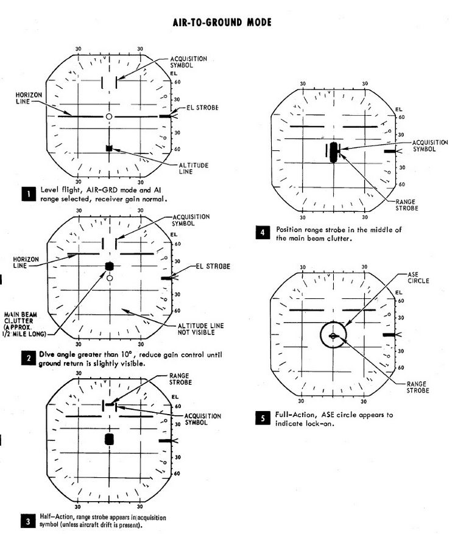

# Air to Ground Radar Operation

Radar operation air-to-ground includes the AIR-GRD mode and RDR-PPI and MAP-PPI.

AIR-GRD mode is used as a form of radar ranging for WRCS DT. RDR-PPI and MAP-PPI
are used for WRCS offset bomb and target find modes.

## Air-To-Ground Ranging

AIR-GRD mode is available when the [Mode Knob](interface.md#radar-modes-mode) is
positioned in the AIR-GRD position. AIR-GRD is used for air-to-ground ranging
and is available only in AI ranges. In this mode the antenna is fixed to the
radar boresight while also being stabilized in drift, this drift correction can
be removed by setting Drift Out on the [Stab Switch](interface.md#stab-switch)
in-case of INS malfunction.

AIR-GRD mode disables [Angle Track](interface.md#angle-track) operation and only
uses [Range Track](interface.md#range-track). Once locked on the main lobe
clutter (ground radar echo), it will be tracked in range.

To use AIR-GRD, 5 or 10 nmi range should be selected. Once the target has been
identified the pilot should make a 10 to 40 degree dive towards the target. The
receiver gain should be reduced to produce a clutter signal of approximately 1/2
nmi. This is done to prevent erroneous track of sidelobes which would result in
incorrect ranging information.

The AIR-GRD acquisition procedure is as follows:

1. Adjust receiver gain to reduce clutter signal to 1/2 nmi.
2. Position range strobe over clutter signal.
3. Press Action Switch to half and then full action. Release after ASE circle is
   visible.
4. Confirm Lock-on.

> 💡 The radar can track ground clutter from beyond 25,000 ft, however is
> limited by the same number to what can be fed into the WRCS.

Sometimes false tracking can occur, which is indicated by a rapid decrease in
slant range displayed on either the optical sight or radar.

To correct this condition the following actions can be taken:

1. Press Action Switch to half action, release.
2. Begin acquisition process again.

## Map Mode (PPI)

Radar Map mode PPI (position plan indicator) is a display which shows radar
returns plotted with their real position relative to the aircraft. The aircraft
position is at the bottom center of the display, lines parallel to the vertical
axis of the display are parallel to the aircraft track. Lines parallel to the
horizontal axis of the display are offset from the track up to a maximum of half
the current display range.

PPI Mode can be accessed by changing the
[Display Knob](interface.md#display-knob) into PPI-WIDE or PPI-NAR. With the
exception of 5 nmi which is always displayed in B-Scope interpretation.

The range cursor is an arc of constant range from the aircraft. The offset
cursor is an offset parallel to the drift of the aircraft, which can be offset
left or right of the aircraft's current track. Offset Cursor and Range Cursor
can only be displayed in PPI modes.

Both Range and Offset Cursor are displayed if
[Weapon Delivery Mode](../../systems/weapon_systems/multiple_weapons_system.md#mode-selection---delivery-mode-knob)
is set to TGT FIND or OFFSET, or
[Radar Mode Knob](interface.md#radar-modes-mode) is set to BEACON. If this is
not the case, then only the Range Cursor is displayed at a fixed range which can
be adjusted by the ground crew.

The
[Along Track Control](../../cockpit/wso/right_console/center_section.md#along-track-wheel)
is used to increase and decrease the current setting for the range cursor. The
[Cross Track Control](../../cockpit/wso/right_console/center_section.md#cross-track-wheel)
is used to move the offset cursor to the left and right of the aircraft's track.

